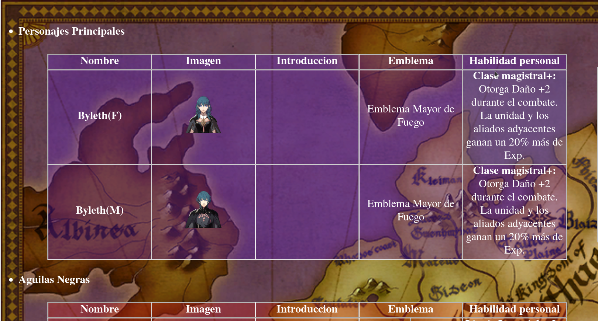
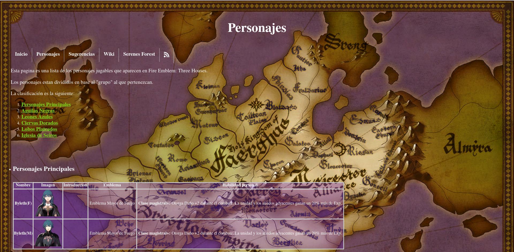
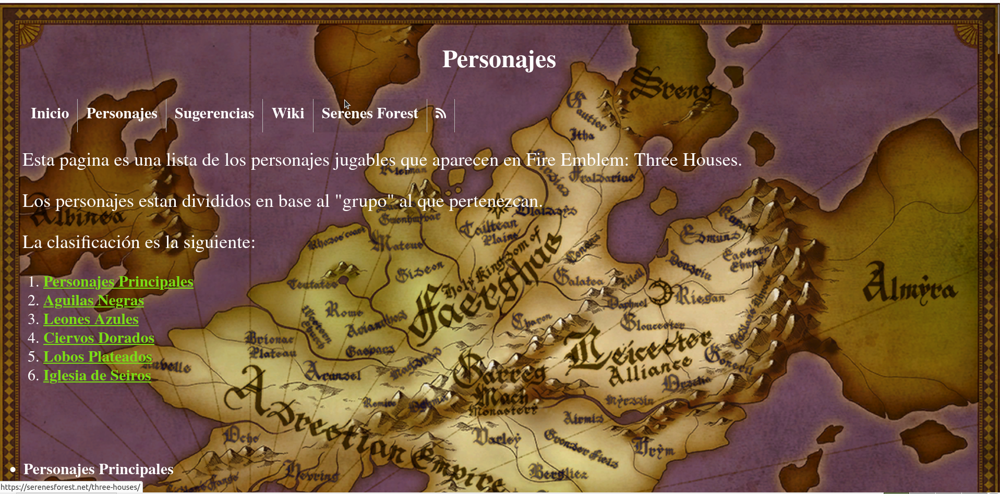

<h1>Pagina Web Responsive</h1>
<h3>Andreu Beltran Miralles</h3>

He modificado la página `characters.html` para que esta sea responsive.

Para esto, he realizado las siguientes modificaciones:

- Primero que nada he puesto el tamaño de la tabla a 90% y sus margenes a 5% por cada lado para que esta ocupe el mismo tamaño independientemente de en que dispositivo sea visualizada.

   `width:90%;`

   `marfin-left: 5%;`

   `margin-right: 5%;`

- Le he dado la propiedad  `table-layout: fixed;` a la tabla para que las columnas de esta ocupen el mismo espacio cada una.

- He puesto la propiedad  `img-width: auto;` a las imágenes para que estas ocupen el tamaño correcto.

- Finalmente he añadido las media querys para que los distintos dispositivos tengan el texto de diferentes tamaños y así facilitar su lectura.

  ```css
  @media(min-width: 560px) {
  td > img{
      width: auto;
  }
  body, th, td, a, h4 {
  font-size: 34px;
  }
  }
  
  @media (min-width: 760px) {
  td > img{
  	width: auto;
  }
  body, th, td, a, h4 {
  font-size: 32px;
  }
  }
  
  @media (min-width: 980px) {
  td > img{
   	width: auto;
  }
  body, th, td, a, h4 {
  font-size: 30px;
  }
  }
  ```

- Imágenes de la página web antes y después de ser responsive:

  - Móvil

    - No Responsive

      

    - Responsive

  

  

  - Tablet

    - No Responsive

      

    - Responsive

      

  - PC

    - No Responsive

      

    - Responsive

      
